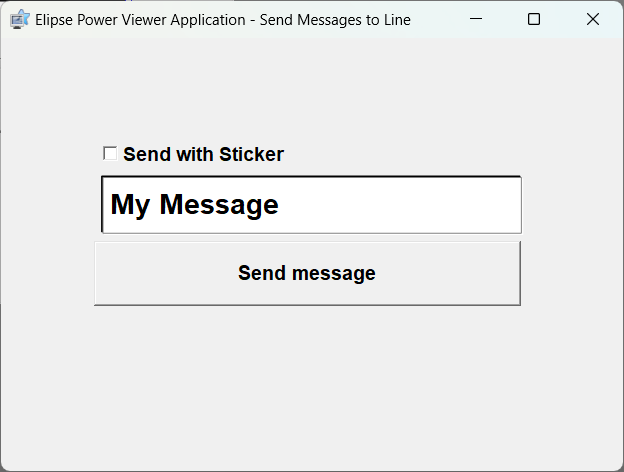

# SendLineNotifications
Send LINE Notifications with Curl from Elipse Software (E3/ Elipse Power)

The button "Send Message" in the Elipse Application Viewer Interface executes a script written in Visual Basic.

You will need to generate your own personal tokens by navigating to <a href="https://notify-bot.line.me/my/" target="_blank">here</a> (LINE account required).

<code>
Set WshShell = CreateObject("WScript.Shell")
WshShell.Run ".\SendMessagetoLINE.bat " & chr(34) & Screen.Item("TextMessage").Value & chr(34) & " " & chr(34) & abs(int(Screen.Item("CheckBoxSticker").Value)) & chr(34)
</code>

The batch file enclosed contains the cURL command that send the LINE message witht the notification. Replace [access_token] with your personal access token.

<code>
curl -X POST -H 'Authorization: Bearer [access_token]' -F 'message=foobar' https://notify-api.line.me/api/notify

-X is for assigning request methods
-H is for assigning request headers
-F is for sending form data
</code>

Elipse Application Interface

 

Messages are received

 

